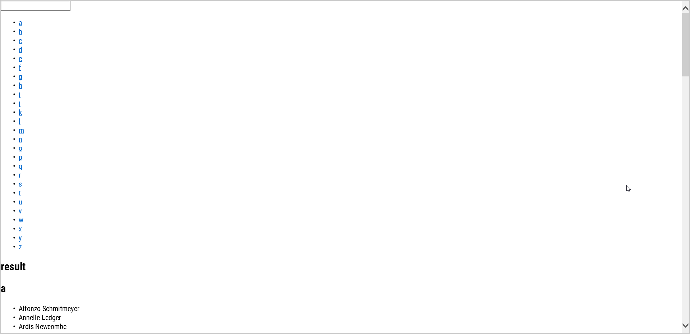
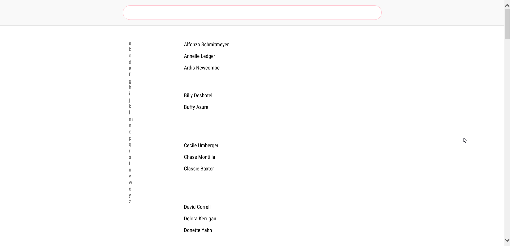

# make-a-list app demo

## Description
This demo is made using plain html, css and js. The idea was to start small: make a list where you can delete stuff. Making it work well with older browsers like IE 9. Working my way up to newer versions adding newer features. 

That's step 1. Step 2 was to make it so that when a user refresh the page the list still exists. So by using localstorage we will be able to get the items from the list and also remvoe them if we want.

Using a server we can store lists and show them to the user for later use. There are tow buttons at the bottom of the page. 

- One saves the current list to the server.
- The other button loads all items from localStorage.

In the future I want it to work offline either completely, or part of it and also make it more Google Keep like, where you can save a list and give it a name so you can access it later.

## Browser Support
The app works on some old and most if not all new browsers. Older browser have limited functionality especially when javascript is limited or not supported. When I talk about old browsers I almost always mean IE < 9.



From Internet Explorer 9 onwards it works as intended



## Device Support
most browser on mobile Devices. Should work on Kindle although functionality is limited for obvious reasons.

On mobile:


## Fallback
Here are some of the problems I encoutenred:
- problem #1 preventdefault doesnt work (on IE). 
fix
```
 ecvent.returnValue = false;
 // for event.preventDefault
```
- problem #2 forEach does not work on IE. fix: no forEach loops, only normal for loops
- problem #3 e.target.matches is not supported (on IE). 
fix: 
```
e.target.msMatchesSelector 
```
- problem #4 autofocus on textbox does not work.
- problem #5 querySelector does not work on ie 8. 


## Run app
When you have [NODE](https://nodejs.org/en/) & [NPM](https://www.npmjs.com/) on your computer run the following command:
```
npm start
```
Then go to 
> http://localhost:3000/

Or use xpose server with:
```
npm run x
```

### Sources
- [quirksmode (Event Delegation)](http://www.quirksmode.org/js/events_order.html)
- [e.target.matches fix](http://stackoverflow.com/questions/37304037/why-my-code-dont-working-in-ie11)
- [preventdefault fix](http://stackoverflow.com/questions/4479216/does-internet-explorer-supports-e-preventdefault)
- [Javascript get index of child on click](https://stackoverflow.com/questions/20818790/javascript-get-index-of-child-on-click)
-[remove item from array in localstorage](https://stackoverflow.com/questions/39725221/remove-an-item-from-an-array-inside-a-local-storage-object-with-javascripthttps://stackoverflow.com/questions/20818790/javascript-get-index-of-child-on-click)

