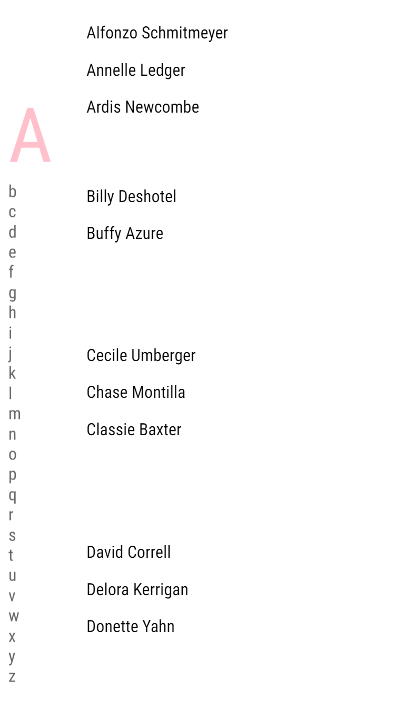

# contact list prototype

## Description
This is a contactlist losely inspired by my phones contactlist. This demo is made using plain html, css and js. The idea was to start small: In a long list of names a user should be adble to find a contact.

That's step 1. Step 2 was to make it so that goal is easier to do. The app is progresively enhanced. Meaning the basic functionality, which is find someone quick, should work on older browsers.

## Core functionality
- User can click on a letter and the list jumps to te first name which begins with the letter.
- No matter what names are shown the autosuggest should work dynamically.
- without clientside JavaScript a user should be able to get search results of names.

## Extra features/ enhancements
- smooth scrolling when clicking on a letter from the side navigation
- autosuggest shows in realtime while typng.
- When a section of names is at the top of the page show indicator in side navigation.

## Browser Support
The app works on all browser, but functionality differs. Older browser have limited functionality especially when javascript is limited or not supported. Older browsers meaning IE < 9.

### Intenet Explorer 8

Navigating with side navigation works. Autosuggest does not work dynamicaly.

### internet Explorer 9

Autosuggest works dynamicaly from IE 9 onwards.

Navigating with the side nav works without javascript, so that works on all browsers. Javascript is only used for the smooth animation. There is also [this CSS version](https://css-tricks.com/almanac/properties/s/scroll-behavior/), which doesnt use Javascript at all, but you can't control the speed of the animation and support is very limited.

Using tabs to navigate is possible. The app is semantically made with the correct html tags. Screenreader support should be no problem (tested witth NVDA).

On modern browsers the indicator to see hich letter you are at the contact list animates to indicate where you are in the list.

## Device Support
most browser on mobile Devices. Should work on Kindle although functionality is limited for obvious reasons.

On mobile:




## Fallback
Here are some of the problems I encoutenred:
- problem #1 classList.add / classList.remove doesnt work (on IE). 
fix
```
 <element>.className = ' <class>';
```

- problem #2 forEach does not work on IE. fix: no forEach loops, only normal for loops
```
for (var x = 0; x < array.length; x++) {
   var list = array[x].innerHTML;
   otherarray.push(list)
 };
```

- problem #4 autofocus on textbox does not work.


## Run app
To see it live and go trough the Oauth flow your self clone this repo, run the following command in the terminal
```
git clone
```

Then start server by running the following in terminal from the folder
```
npm start
```

Then go to 
> http://localhost:3000/

Or use xpose server to test performance with:
```
npm run x
```

### Sources
- [classList not working in IE](https://stackoverflow.com/questions/8098406/code-with-classlist-does-not-work-in-ie)
- [Element.getBoundingClientRect()](https://developer.mozilla.org/en-US/docs/Web/API/Element/getBoundingClientRect)
